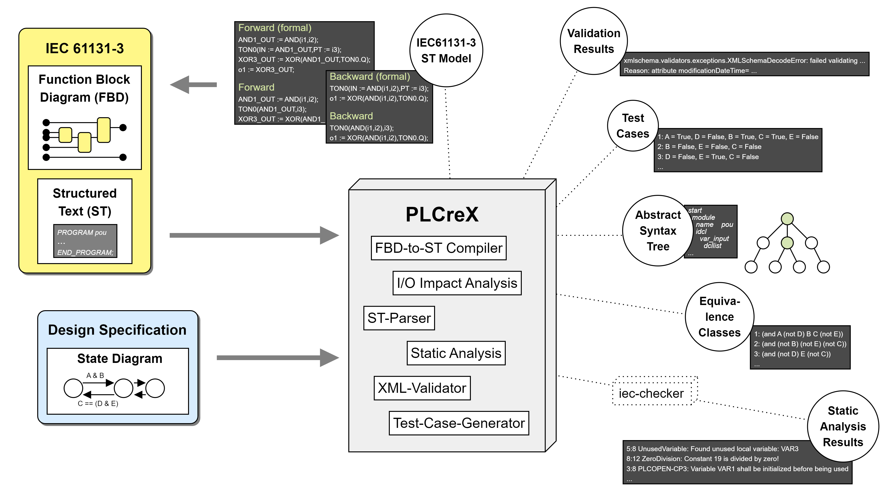

# PLCreX - Analysis of IEC 61131-3 Programmable Logic Controllers

PLCreX is a modular command-line interface (CLI) application tailored for IEC 61131-3 Programmable Logic Controllers ([PLCs](https://en.wikipedia.org/wiki/Programmable_logic_controller)). It's designed with a focus on issues such as **re**view, **re**design, **re**use, and **re**liability, among others. This project is driven by our ongoing research and we're committed to progressively integrating new features. PLCreX serves as a comprehensive suite of analysis and reuse capabilities for existing IEC 61131-3 Program Organization Units ([POUs](https://en.wikipedia.org/wiki/IEC_61131-3#Program_organization_unit_(POU))) implemented in Function Block Diagrams (FBDs) or Structured Text (ST).

## Quick links

* [📄 PLCreX’s documentation](https://plcrex.readthedocs.io/en/latest/)
* [🛠 Getting Started](#-getting-started)
* [💻 Commands](#-commands)
* [ℹ️ Licenses](#-licenses)
---

## 🛠 Getting Started

### Prerequisites
* [Python](https://www.python.org/downloads/): 3.11
* Operating System: Windows
* [optional] Download [iec-checker](https://github.com/jubnzv/iec-checker/releases/tag/v0.4) (static analysis of IEC 61131-3 programs)

###  Installation via PyPI
Run ``pip install plcrex`` to get PLCreX using PyPI

### Installation via GitHub
1. Download or clone PLCreX repository
2. Run ``install-windows.bat`` to automatically create a virtual environment (venv) and installation of dependencies
3. [optional] Run ``coverage run -m pytest ./tests/ --verbose`` for local tests
4. [optional] Run ``coverage report -m`` to check test results

         Name                                       Stmts   Miss  Cover   Missing
         ------------------------------------------------------------------------
         plcrex\__init__.py                             4      0   100%          
         plcrex\cli.py                                 73      1    99%   122    
         plcrex\tools\__init__.py                       0      0   100%          
         plcrex\tools\ds2ts\__init__.py                 0      0   100%          
         plcrex\tools\ds2ts\_ds2ts.py                   3      0   100%          
         plcrex\tools\fbd2ia\__init__.py                0      0   100%
         plcrex\tools\fbd2ia\_fbd2ia.py                 4      0   100%
         plcrex\tools\fbd-to-st\__init__.py             0      0   100%
         plcrex\tools\fbd-to-st\_fbd2st.py              4      0   100%
         plcrex\tools\iec_checker\__init__.py           0      0   100%
         plcrex\tools\iec_checker\_iec_checker.py       4      0   100%
         plcrex\tools\st2ast\__init__.py                0      0   100%
         plcrex\tools\st2ast\_st2ast.py                34      0   100%
         plcrex\tools\xmlval\__init__.py                0      0   100%
         plcrex\tools\xmlval\_xmlval.py                16      0   100%
         tests\__init__.py                              0      0   100%
         tests\test_ds2ts.py                           10      0   100%
         tests\test_fbd2st.py                          69      0   100%
         tests\test_fbd_io_checker.py                   7      0   100%
         tests\test_help.py                             6      0   100%
         tests\test_iec_checker.py                     32      0   100%
         tests\test_st2tree.py                         25      0   100%
         tests\test_version.py                         12      0   100%
         tests\test_xml_checker.py                     19      0   100%
         ------------------------------------------------------------------------
         TOTAL                                        322      1    99%

| ⚠ If no IEC Checker (.exe) is available, ``test_iec_checker.py`` will fail. |
|-----------------------------------------------------------------------------|

## 💻 Commands

### PLCreX
      
      (venv) C:\Tools\PLCreX>python -m plcrex --help
      
           ██████╗ ██╗      ██████╗██████╗ ███████╗██╗  ██╗
           ██╔══██╗██║     ██╔════╝██╔══██╗██╔════╝╚██╗██╔╝
           ██████╔╝██║     ██║     ██████╔╝█████╗   ╚███╔╝
           ██╔═══╝ ██║     ██║     ██╔══██╗██╔══╝   ██╔██╗
           ██║     ███████╗╚██████╗██║  ██║███████╗██╔╝ ██╗
           ╚═╝     ╚══════╝ ╚═════╝╚═╝  ╚═╝╚══════╝╚═╝  ╚═╝
      
       Usage: plcrex [OPTIONS] COMMAND [ARGS]...
      
      ┌─ Options ─────────────────────────────────────────────────────────────────────────────┐
      │ --version  -v                                                                         │
      │ --help               Show this message and exit.                                      │
      └───────────────────────────────────────────────────────────────────────────────────────┘
      ┌─ Commands ────────────────────────────────────────────────────────────────────────────┐
      │ fbd-to-st                                                                             │
      │ iec-checker                                                                           │
      │ impact-analysis                                                                       │
      │ st-parser                                                                             │
      │ test-case-gen                                                                         │
      │ xml-validator                                                                         │
      └───────────────────────────────────────────────────────────────────────────────────────┘

### FBD-to-ST Compiler              

       Usage: plcrex fbd-to-st [OPTIONS] SRC EXPORT
      
      ┌─ Arguments ───────────────────────────────────────────────────────────────────────────┐
      │ *    src         PATH  [default: None] [required]                                     │
      │ *    export      PATH  [default: None] [required]                                     │
      └───────────────────────────────────────────────────────────────────────────────────────┘
      ┌─ Options ─────────────────────────────────────────────────────────────────────────────┐
      │ --bwd       --no-bwd         use backward translation [default: no-bwd]               │
      │ --formal    --no-formal      formal parameter list [default: no-formal]               │
      │ --help                       Show this message and exit.                              │
      └───────────────────────────────────────────────────────────────────────────────────────┘

### IEC-Checker

       Usage: plcrex iec-checker [OPTIONS] SRC EXE
      
      ┌─ Arguments ───────────────────────────────────────────────────────────────────────────┐
      │ *    src      PATH  [default: None] [required]                                        │
      │ *    exe      PATH  [default: None] [required]                                        │
      └───────────────────────────────────────────────────────────────────────────────────────┘
      ┌─ Options ─────────────────────────────────────────────────────────────────────────────┐
      │ --verbose             --no-verbose      print full log [default: no-verbose]          │
      │ --help_iec_checker                      call iec-checker help                         │
      │ --help                                  Show this message and exit.                   │
      └───────────────────────────────────────────────────────────────────────────────────────┘

### I/O-Impact Analysis

       Usage: plcrex impact-analysis [OPTIONS] SRC EXPORT
      
      ┌─ Arguments ───────────────────────────────────────────────────────────────────────────┐
      │ *    src         PATH  [default: None] [required]                                     │
      │ *    export      PATH  [default: None] [required]                                     │
      └───────────────────────────────────────────────────────────────────────────────────────┘
      ┌─ Options ─────────────────────────────────────────────────────────────────────────────┐
      │ --help          Show this message and exit.                                           │
      └───────────────────────────────────────────────────────────────────────────────────────┘

### ST-Parser

       Usage: plcrex st-parser [OPTIONS] SRC EXPORT
      
      ┌─ Arguments ───────────────────────────────────────────────────────────────────────────┐
      │ *    src         PATH  [default: None] [required]                                     │
      │ *    export      PATH  [default: None] [required]                                     │
      └───────────────────────────────────────────────────────────────────────────────────────┘
      ┌─ Options ─────────────────────────────────────────────────────────────────────────────┐
      │ --txt         --no-txt           tree export as *.txt [default: txt]                  │
      │ --dot         --no-dot           tree export as *.dot [default: dot]                  │
      │ --beckhoff    --no-beckhoff      use Beckhoff TwinCAT ST grammar                      │
      │                                  [default: no-beckhoff]                               │
      │ --help                           Show this message and exit.                          │
      └───────────────────────────────────────────────────────────────────────────────────────┘

### Test-Case-Generator

       Usage: plcrex test-case-gen [OPTIONS] FORMULA
      
      ┌─ Arguments ───────────────────────────────────────────────────────────────────────────┐
      │ *    formula      TEXT  [default: None] [required]                                    │
      └───────────────────────────────────────────────────────────────────────────────────────┘
      ┌─ Options ─────────────────────────────────────────────────────────────────────────────┐
      │ --help          Show this message and exit.                                           │
      └───────────────────────────────────────────────────────────────────────────────────────┘

### XML-Validator

       Usage: plcrex xml-validator [OPTIONS] SRC
      
      ┌─ Arguments ───────────────────────────────────────────────────────────────────────────┐
      │ *    src      PATH  [default: None] [required]                                        │
      └───────────────────────────────────────────────────────────────────────────────────────┘
      ┌─ Options ─────────────────────────────────────────────────────────────────────────────┐
      │ --v201    --no-v201      use tc6_xml_v201.xsd [default: no-v201]                      │
      │ --help                   Show this message and exit.                                  │
      └───────────────────────────────────────────────────────────────────────────────────────┘

## ℹ️ Licenses
<table>
   <tr>
      <td>
         Description
      </td>
      <td>
         Version
      </td>
      <td>
         License
      </td>
   </tr>
   <tr>
      <td>
         PLCreX
      </td>
      <td>
         -
      </td>
      <td>
         GPLv3
      </td>
   </tr>
   <tr>
      <td>
         STgrammar_Beckhoff.lark <a href="https://github.com/klauer/blark">(🔗 Blark)</a>
      </td>
      <td>
         0.5.0
      </td>
      <td>
         GPLv2
      </td>
   </tr>
   <tr>
      <td>
         ds2ts_R1_2_0.cp311-win_amd64.pyd
      </td>
      <td>
         1.2.0
      </td>
      <td>
         -
      </td>
   </tr>
   <tr>
      <td>
         fbd2ia_R1_2_0.cp311-win_amd64.pyd
      </td>
      <td>
         1.2.0
      </td>
      <td>
         -
      </td>
   </tr>
   <tr>
      <td>
         fbd2st_R1_2_0.cp311-win_amd64.pyd
      </td>
      <td>
         1.2.0
      </td>
      <td>
         -
      </td>
   </tr>
</table>