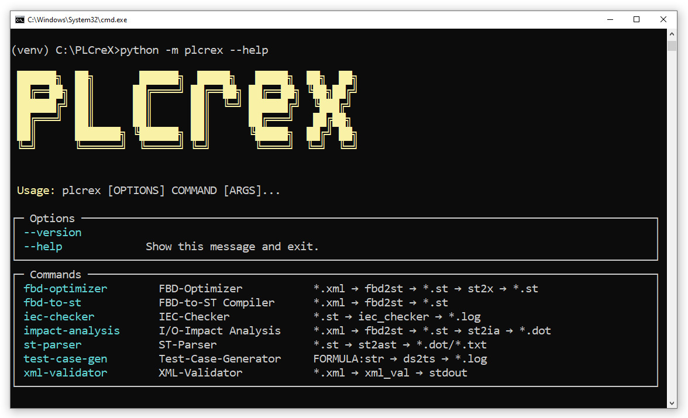

Command Line Interface
======================

.. cli:

|

Installed via PyPI
------------------

1. Run the following command to call PLCreX's help

.. code:: console

    C:\PLCreX>python -m plcrex --help

Installed via GitHub
--------------------

1. Run the following command to activate virtual environment (venv)

.. code:: console

    run.bat

2. Run the following command to call PLCreX's help

.. code-block:: console

    (venv) C:\PLCreX>python -m plcrex --help