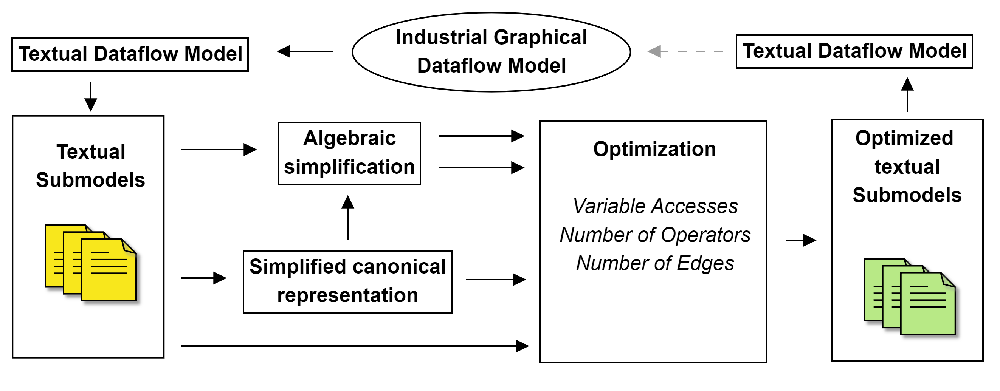
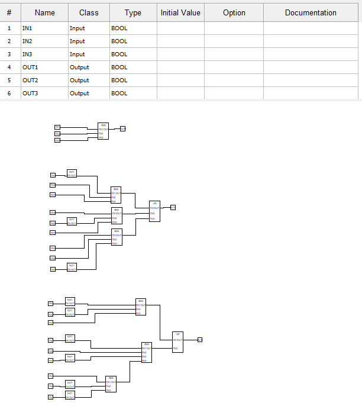
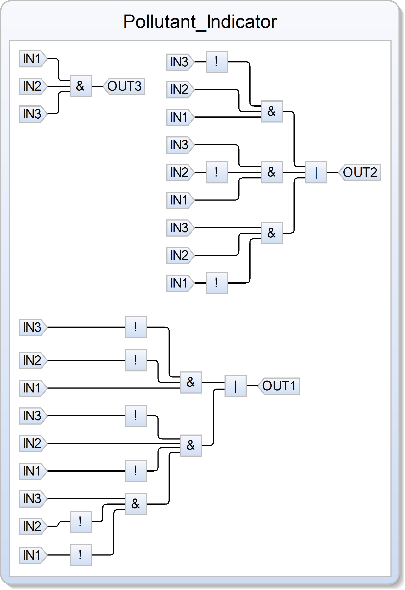
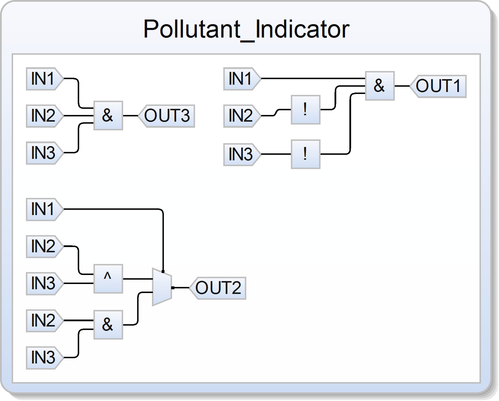

FBD-to-SCCharts Compiler
========================

.. fbd_to_sctx:

The FBD-to-SCCharts Compiler represents a feature for optimizing FBDs, where the behavior of instantiated function blocks can be unknown. The optimization approach is shown in figure below and involves configuration with respect
to Halstead’s metrics N (number of edges) ``--edge-opt``, N1 (number of operators) ``--op-opt``, and N2 (variable accesses) ``--var-opt``. Furthermore, this feature translates FBDs into Sequentially Constructive Statecharts (SCCharts) for reuse in model-based design of reactive systems and formal verification [3].

**Usage**

.. code-block:: console

    python -m plcrex fbd-to-sctx --help

.. code:: console

         Usage: plcrex fbd-to-sctx [OPTIONS] SOURCE EXE EXPORT

         FBD-to-SCCharts Compiler (Data-Flow)    *.xml → *.sctx

        ╭─ Arguments ──────────────────────────────────────────────────────────────────────────────────╮
        │ *    source      PATH  source path [default: None] [required]                                │
        │ *    exe         PATH  NuSMV.exe path [default: None] [required]                             │
        │ *    export      PATH  export path [default: None] [required]                                │
        ╰──────────────────────────────────────────────────────────────────────────────────────────────╯
        ╭─ Options ────────────────────────────────────────────────────────────────────────────────────╮
        │ --edge-opt    --no-edge-opt      optimize edges [default: no-edge-opt]                       │
        │ --var-opt     --no-var-opt       optimize variables [default: no-var-opt]                    │
        │ --op-opt      --no-op-opt        optimize operators [default: no-op-opt]                     │
        │ --help                           Show this message and exit.                                 │
        ╰──────────────────────────────────────────────────────────────────────────────────────────────╯

..
    .. figure:: ../fig/fbd_optimizer_demo.png
        :align: center
        :width: 600px

|

POU ``Pollutant_Indicator_WITH_ERROR.xml``
------------------------------------------

The following POU was manually implemented using Beremiz [`.url <https://github.com/beremiz/beremiz>`_].

|

Example 1: ``--no-edge-opt``, ``--no-var-opt``, ``--no-op-opt``
----------------------------------------------------------------

**Command**

.. code-block:: console

    python -m plcrex fbd-to-sctx "tests/real_world_FBDs/Pollutant_Indicator_WITH_ERROR.xml" "bin/NuSMV.exe" ".\exports\01"

**Results**

``01_no_opt.sctx``

.. code-block:: console

    //--- This file was generated by PLCreX ---
    //--- https://github.com/marwern/PLCreX ---
    //-----------------------------------------

    scchart Pollutant_Indicator{
     input bool IN1
     input bool IN2
     input bool IN3
     output bool OUT1
     output bool OUT2
     output bool OUT3
     dataflow{
     OUT1=((!(IN3)&!(IN2)&IN1)|(!(IN3)&IN2&!(IN1)&(IN3&!(IN2)&!(IN1))))
     seq
     OUT2=((!(IN3)&IN2&IN1)|(IN3&!(IN2)&IN1)|(IN3&IN2&!(IN1)))
     seq
     OUT3=(IN1&IN2&IN3)
     seq}}

|

Example 2: ``--edge-opt``
--------------------------

**Command**

.. code-block:: console

    python -m plcrex fbd-to-sctx --edge-opt "tests/real_world_FBDs/Pollutant_Indicator_WITH_ERROR.xml" "bin/NuSMV.exe" ".\exports\01"

**Results**

``01_edge_opt.sctx``

.. code-block:: console

    //--- This file was generated by PLCreX ---
    //--- https://github.com/marwern/PLCreX ---
    //-----------------------------------------

    scchart Pollutant_Indicator{
     input bool IN1
     input bool IN2
     input bool IN3
     output bool OUT1
     output bool OUT2
     output bool OUT3
     dataflow{
     OUT1=(IN1&!(IN2)&!(IN3))
     seq
     OUT2=((IN1)?(((IN2)^(IN3))):((IN2&IN3)))
     seq
     OUT3=(IN1&IN2&IN3)
     seq}}

|
