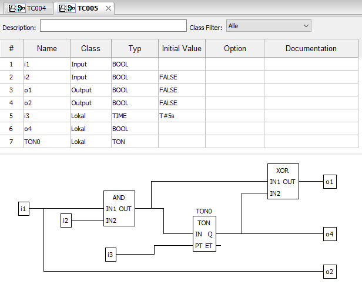

FBD-to-ST Compiler
==================

.. fbd_to_st:

The FBD-to-ST Compiler translates IEC 61131-3 FBDs stored in PLCopen XML format into ST POUs. In this context, PLCreX supports the translation in different formats, which are shown in the following picture. In general, PLCreX distinguishes between a **formal** representation of the parameter list of instantiated POUs,
for example ``TONx(IN := A, PT := B);`` and a **non formal** representation, ``TONx(A,B);``. Furthermore, we distinguish between a **forward** translation strategy and a **backward** translation strategy.

.. warning::
    The backward translation strategy can change the semantics because the variables are updated at the end of a cycle. In contrast, without database, additional local variables needed for forward translation are declared as ``BOOL`` by default,
    unless the data type is implicit given by connected component.

**Usage**

.. code-block:: console

    (venv) C:\PLCreX>python -m plcrex fbd-to-st --help

.. code-block:: console

     ██████╗  ██╗       ██████╗  █████╗   █████╗  ██╗  ██╗
     ██╔══██╗ ██║      ██╔════╝ ██╔══██╗ ██╔══██╗ ╚██╗██╔╝
     ██████╔╝ ██║      ██║      ██║  ╚═╝ ██████╔╝  ╚███╔╝
     ██╔═══╝  ██║      ██║      ██║      ██╔═══╝   ██╔██╗
     ██║      ███████╗ ╚██████╗ ██║      ╚█████╗  ██╔╝ ██╗
     ╚═╝      ╚══════╝  ╚═════╝ ╚═╝       ╚════╝  ╚═╝  ╚═╝

     Usage: plcrex fbd-to-st [OPTIONS] SOURCE EXPORT FILENAME

    ┌─ Arguments ───────────────────────────────────────────────────────────────────────────────────────┐
    │ *    source        PATH  source path [default: None] [required]                                   │
    │ *    export        PATH  export path [default: None] [required]                                   │
    │ *    filename      TEXT  filename without file extension [default: None] [required]               │
    └───────────────────────────────────────────────────────────────────────────────────────────────────┘
    ┌─ Options ─────────────────────────────────────────────────────────────────────────────────────────┐
    │ --bwd       --no-bwd         use backward translation [default: no-bwd]                           │
    │ --formal    --no-formal      formal parameter list [default: no-formal]                           │
    │ --help                       Show this message and exit.                                          │
    └───────────────────────────────────────────────────────────────────────────────────────────────────┘

POU
---

The following POU was manually implemented using Beremiz [`.url <https://github.com/beremiz/beremiz>`_].

Example 1: ``--no-formal`` ``--no-bwd``
---------------------------------------

**Command**

.. code-block:: console

    (venv) C:\PLCreX>python -m plcrex fbd-to-st --no-formal --no-bwd ".\tests\plcopen_examples\TC005_PRG.xml" ".\exports" "01"

**Results**

.. code-block:: console

        ...
        AND1_OUT := AND(i1,i2);
        TON0(AND1_OUT,i3);
        XOR3_OUT := XOR(AND1_OUT,TON0.Q);
        o1 := XOR3_OUT;
        o4 := TON0.Q;
        o2 := i1;
        ...

Example 2: ``--no-formal`` ``--bwd``
------------------------------------

**Command**

.. code-block:: console

    (venv) C:\PLCreX>python -m plcrex fbd-to-st --no-formal --bwd ".\tests\plcopen_examples\TC005_PRG.xml" ".\exports" "02"

**Results**

.. code-block:: console

        ...
        TON0(AND(i1,i2),i3);
        o1 := XOR(AND(i1,i2),TON0.Q);
        o4 := TON0.Q;
        o2 := i1;
        ...

Example 3: ``--formal`` ``--no-bwd``
------------------------------------

**Command**

.. code-block:: console

    (venv) C:\PLCreX>python -m plcrex fbd-to-st --formal --no-bwd ".\tests\plcopen_examples\TC005_PRG.xml" ".\exports" "03"

**Results**

.. code-block:: console

        ...
        AND1_OUT := AND(i1,i2);
        TON0(IN := AND1_OUT,PT := i3);
        XOR3_OUT := XOR(AND1_OUT,TON0.Q);
        o1 := XOR3_OUT;
        o4 := TON0.Q;
        o2 := i1;
        ...

Example 4: ``--formal`` ``--bwd``
---------------------------------

**Command**

.. code-block:: console

    (venv) C:\PLCreX>python -m plcrex fbd-to-st --formal --bwd ".\tests\plcopen_examples\TC005_PRG.xml" ".\exports" "04"

**Results**

.. code-block:: console

        ...
        TON0(IN := AND(i1,i2),PT := i3);
        o1 := XOR(AND(i1,i2),TON0.Q);
        o4 := TON0.Q;
        o2 := i1;
        ...