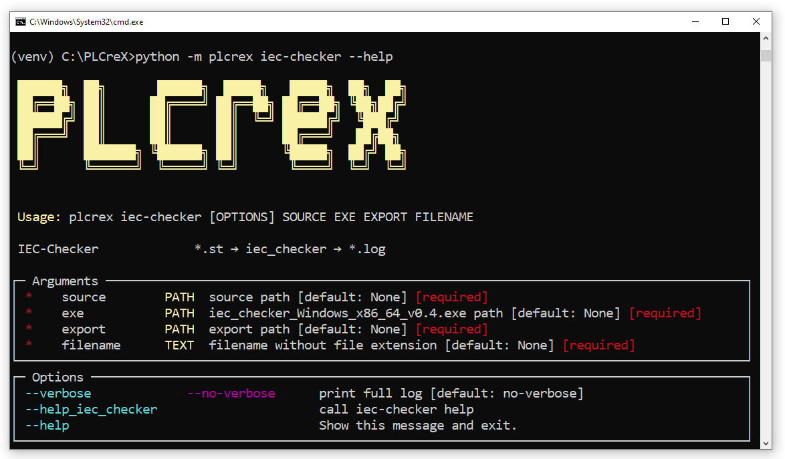

IEC-Checker
===========

.. iec_checker:

The IEC-Checker is an external tool for static code analysis of IEC 61131-3 POUs and called via PLCreX. Among other things, it checks the following issues [`.url <https://github.com/jubnzv/iec-checker>`_]:

* PLCopen Guidelines

    * CP1: Access to a member shall be by name
    * CP2: All code shall be used in the application
    * CP3: All variables shall be initialized before being used
    * CP4: Direct addressing should not overlap
    * CP6: Avoid external variables in functions, function blocks and classes
    * CP8: Floating point comparison shall not be equality or inequality
    * CP9: Limit the complexity of POU code
    * CP13: POUs shall not call themselves directly or indirectly
    * CP25: Data type conversion should be explicit
    * CP28: Time and physical measures comparisons shall not be equality or inequality
    * L10: Usage of CONTINUE and EXIT instruction should be avoided
    * L17: Each IF instruction should have an ELSE clause
* Declaration analysis for derived types
* Intraprocedural control flow analysis: detection of unreachable code blocks inside the POUs
* Detection of unused variables

.. note::
    IEC-Checker can only work with IEC 61131-3 ST supported by the matiec compiler [`.url <https://github.com/beremiz/matiec>`_].
    Most likely, it will fail on the source code containing non-standard language extensions.

**Usage**

.. code-block:: console

    python -m plcrex iec-checker --help

|

POU ``TC083.st``
----------------

.. code-block:: console

    PROGRAM TC083
      VAR_ACCESS
        Var1 : DINT;
        Var2 : DINT;
        Var3 : DINT;
      END_VAR

      Var1 := 19 / 0;
      Var2 := Var1 / 1;
    END_PROGRAM

Example 1
---------

**Command**

.. code-block:: console

    python -m plcrex iec-checker --verbose ".\tests\st_examples\TC083.st" "./bin/iec_checker_Windows_x86_64_v0.4.exe" ".\exports" "01"

**Results**

.. code-block:: console

    ...
    Running check for program TC083
    5:8 UnusedVariable: Found unused local variable: VAR3
    8:12 ZeroDivision: Constant 19 is divided by zero!
    3:8 PLCOPEN-CP3: Variable VAR1 shall be initialized before being used
    4:8 PLCOPEN-CP3: Variable VAR2 shall be initialized before being used
    ...