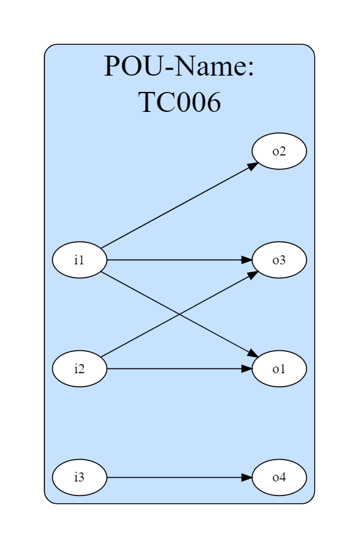

I/O-Impact Analysis
===================

.. impact_analysis:

The I/O-Impact Analysis feature identifies the dependencies between POU outputs and inputs.

**Usage**

.. code-block:: console

    (venv) C:\PLCreX>python -m plcrex impact-analysis --help

.. figure:: ../fig/impact_analysis_demo.png
    :align: center
    :width: 600px

|

POU ``TC006_FBD.xml``
---------------------

The following POU was manually implemented using Beremiz [`.url <https://github.com/beremiz/beremiz>`_].

.. figure:: ../fig/TC006.png
    :align: center
    :width: 450px

|

Example 1
---------

**Command**

.. code-block:: console

    (venv) C:\PLCreX>python -m plcrex impact-analysis ".\tests\plcopen_examples\TC006_FBD.xml" ".\exports" "01"

**Results**

``01.dot``

.. code-block:: console

        ...
        digraph G {
            rankdir=LR;
            graph [pad="0.5", nodesep="1", ranksep="2"];
            splines=spline;
            node [shape=oval fillcolor=white style=filled];
            subgraph cluster_1{
                label="POU-Name:\nTC006";
                style=rounded;bgcolor=slategray1;fontsize = 30;
                i1->o1 i2->o1 i1->o2 i2->o3 i1->o3 i3->o4
            }
        }
        ...

|