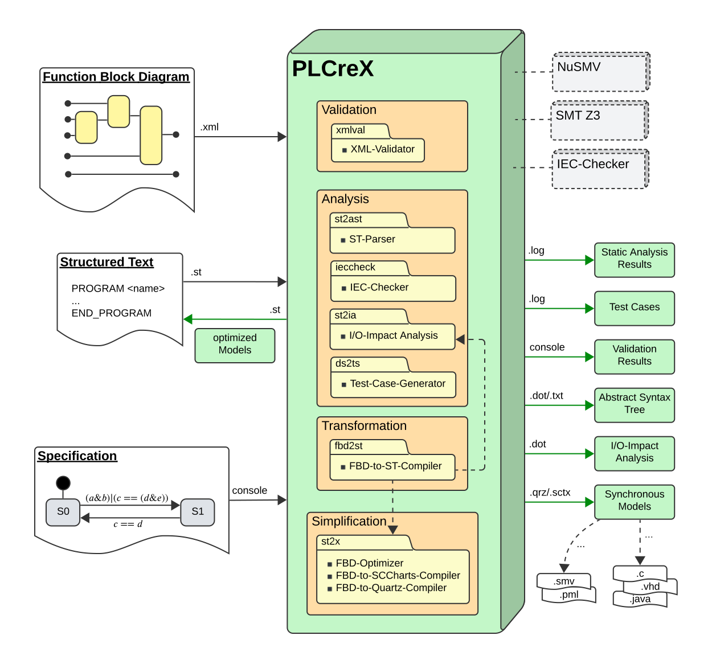

PLCreX - Simplification, Transformation, Analysis, and Validation of IEC 61131-3 Programmable Logic Controllers
===============================================================================================================

.. index:

About PLCreX
------------

PLCreX is a modular command-line interface application tailored for IEC 61131-3 Programmable Logic Controllers (PLCs) and beyond. It's designed with a focus on issues such as review, redesign, reuse, and reliability, among others. This project is driven by our ongoing research and we're committed to progressively integrating new features. PLCreX serves as a comprehensive suite of analysis and reuse capabilities for existing IEC 61131-3 Program Organization Units (POUs) implemented in Function Block Diagrams (FBDs) or Structured Text (ST).

|

..
    ..  toctree::
        :glob:
        :titlesonly:

        *

.. toctree::
    :maxdepth: 2
    :caption: Getting Started
    :hidden:

    install
    test
   
.. toctree::
    :maxdepth: 2
    :caption: Usage and Examples
    :hidden:
   
    cli
    fbd_optimizer
    fbd_to_st
    iec_checker
    impact_analysis
    st_parser
    test_case_gen
    xml_validator

.. toctree::
    :maxdepth: 2
    :caption: Additional Resources
    :hidden:

    publications

    contact