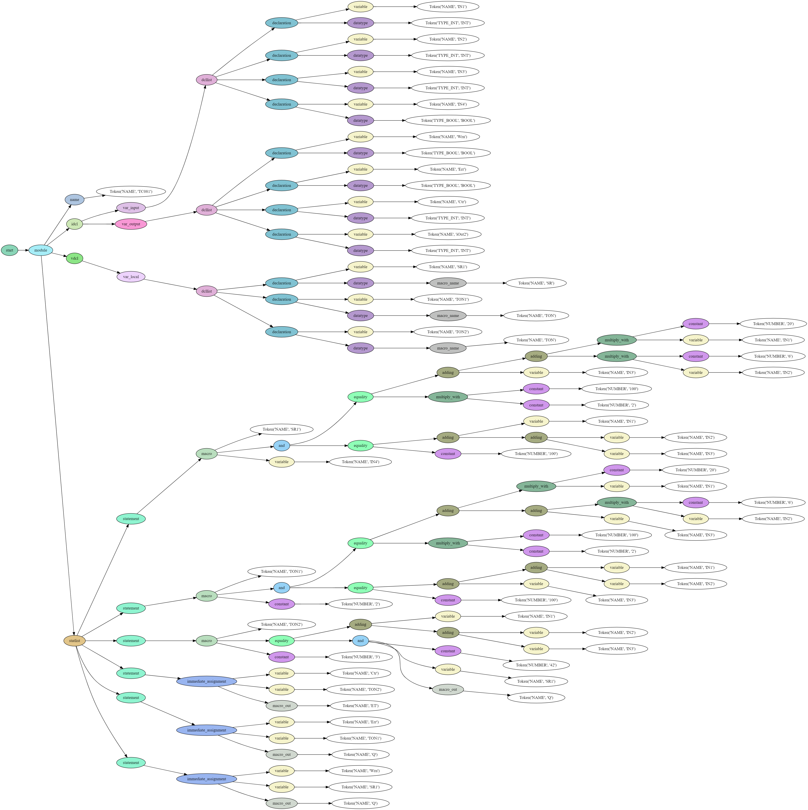

ST-Parser
=========

.. st-parser:

The ST-Parser includes an executable grammar for IEC 61131-3 ST POUs as well as the possibility to save the
resulting syntax tree visually or as plain text and reuse it for subsequent analysis. The embedded grammar covers the following constructs:

* IEC 61131-3 POU-Types: ``Program``, ``Functionblock``, ``Function``
* Sections (each available only once): ``VAR_INPUT``, ``VAR``, ``VAR_OUTPUT``, ``VAR_IN_OUT``, ``VAR_EXTERNAL``
* Data types: ``BOOL``, ``INT``, ``DINT``, ``UINT``, ``REAL``, ``TIME``, ``ARRAY``
* Operators: ``*``, ``/``, ``MOD``, ``+``, ``-``, ``NOT``, ``AND``, ``XOR``, ``OR``, ``<=``, ``>=``, ``<``, ``>``, ``=``, ``<>``, ``FALSE``, ``TRUE``, ``external function/functionblocks``, ``variable``, ``constant````
* Statements: ``assignments``, ``if/else``, ``case``, ``macro``, ``for``, ``while``, ``repeat``, ``exit``, ``return``
* Parameter list: informal, e.g. ``TONx(A,B);`` instead of ``TONx(IN := A, PT := B);``


**Usage**

.. code-block:: console

    (venv) C:\PLCreX>python -m plcrex st-parser --help

.. code-block:: console

     ██████╗  ██╗       ██████╗  █████╗   █████╗  ██╗  ██╗
     ██╔══██╗ ██║      ██╔════╝ ██╔══██╗ ██╔══██╗ ╚██╗██╔╝
     ██████╔╝ ██║      ██║      ██║  ╚═╝ ██████╔╝  ╚███╔╝
     ██╔═══╝  ██║      ██║      ██║      ██╔═══╝   ██╔██╗
     ██║      ███████╗ ╚██████╗ ██║      ╚█████╗  ██╔╝ ██╗
     ╚═╝      ╚══════╝  ╚═════╝ ╚═╝       ╚════╝  ╚═╝  ╚═╝

     Usage: plcrex st-parser [OPTIONS] SOURCE EXPORT FILENAME

    ┌─ Arguments ───────────────────────────────────────────────────────────────────────────────────────┐
    │ *    source        PATH  source path [default: None] [required]                                   │
    │ *    export        PATH  export path [default: None] [required]                                   │
    │ *    filename      TEXT  filename without file extension [default: None] [required]               │
    └───────────────────────────────────────────────────────────────────────────────────────────────────┘
    ┌─ Options ─────────────────────────────────────────────────────────────────────────────────────────┐
    │ --txt         --no-txt           tree export as *.txt [default: txt]                              │
    │ --dot         --no-dot           tree export as *.dot [default: dot]                              │
    │ --beckhoff    --no-beckhoff      use Beckhoff TwinCAT ST grammar [default: no-beckhoff]           │
    │ --help                           Show this message and exit.                                      │
    └───────────────────────────────────────────────────────────────────────────────────────────────────┘


POU
---

.. code-block:: console

    FUNCTION_BLOCK TC081
        VAR_INPUT
            IN1 : INT;
            IN2 : INT;
            IN3 : INT;
            IN4 : BOOL;
        END_VAR
        VAR_OUTPUT
            Wrn : BOOL;
            Err : BOOL;
            Ctr : INT;
            iOut2 : INT;
        END_VAR
        VAR
            SR1 : SR;
            TON1 : TON;
            TON2 : TON;
        END_VAR

        SR1(((((20*IN1)+(6*IN2)+IN3))=(100*2)) AND (IN1+IN2+IN3=100),IN4);
        TON1((((((20*IN1)+(6*IN2)+IN3))=(100*2)) AND (IN1+IN2+IN3=100)),2);
        TON2(IN1+IN2+IN3=42 AND SR1.Q,3);
        Ctr := TON2.ET;
        Err := TON1.Q;
        Wrn := SR1.Q;
    END_FUNCTION_BLOCK


Example 1
---------

**Command**

.. code-block:: console

    (venv) C:\Python\plcrex_project>python -m plcrex st-parser ".\tests\st_examples\TC081.st" ".\exports" "01"

**Results**

``01.dot``

.. code-block:: console

    digraph G {
    rankdir=LR;
    0 [label="Token('NAME', 'TC081')"];
    1 [fillcolor="#aec5e0", label=name, style=filled];
    1 -> 0;
    ...

``01.txt``

.. code-block:: console

    start
      module
        name	TC081
        idcl
          var_input
            dcllist
              declaration
                variable	IN1
                datatype	INT
              declaration
                variable	IN2
                datatype	INT
              declaration
                variable	IN3
                datatype	INT
              declaration
                variable	IN4
    ...

