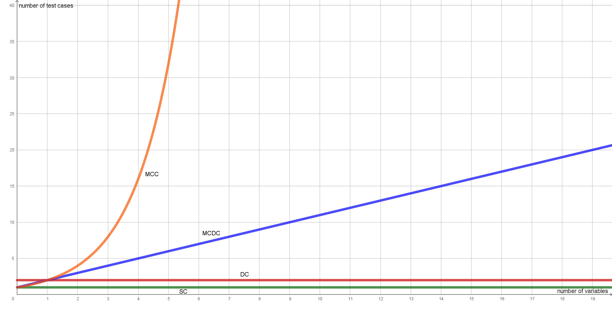

Test-Case-Generator
===================

.. test_case_gen:

This feature automatically creates test cases based on a Boolean expression. Specifically, the user can choose between test cases intended to achieve ``statement coverage``, ``decision coverage``, ``modified condition/decision coverage``, or ``multiple condition coverage``.

Types of Code Coverage
-----------------------

The different types of coverage are listed below and defined as follows [`A Practical Tutorial on Modified Condition/
Decision Coverage <https://shemesh.larc.nasa.gov/fm/papers/Hayhurst-2001-tm210876-MCDC.pdf>`_]:

* Statement Coverage (SC)
    Each executable statement in a program is called at least once.

* Decision Coverage (DC)
    Decision coverage requires two test cases: one for a ``true`` outcome and one for a ``false`` outcome.

* Modified Condition/Decision Coverage (MCDC)
    Every condition is independently proved to affect the outcome of the decision. The independence requirement ensures that the effect of each condition is tested with respect to the other conditions.

* Multiple Condition Coverage (MCC)
    MCC requires test cases that ensure that every possible combination of inputs to a decision is executed at least once.

.. list-table::
   :widths: 25 5 5 5 5
   :header-rows: 1

   * - Coverage criteria
     - SC
     - DC
     - MCDC
     - MCC
   * - | Every statement in the program
       | has been invoked at least once
     - x
     - x [1]_
     - x [1]_
     - x [1]_
   * - | Every decision in the program has
       | taken all possible outcomes at least
       | once
     -
     - x
     - x
     - x
   * - | Every condition in a decision in the
       | program has taken all possible
       | outcomes at least once
     -
     -
     - x
     - x
   * - | Every combination of condition
       | outcomes within a decision has
       | been invoked at least once
     -
     -
     -
     - x
   * - Number of test cases [1]_
     - 1
     - 2
     - n+1
     - n^2

**Operators**

The following operators are supported:

.. list-table::
   :widths: 25 25
   :header-rows: 1

   * - Operator
     - Description
   * - &
     - conjunction
   * - \|
     - disjunction
   * - ^
     - exclusive or
   * - ~
     - negation
   * - <=>
     - equality

**Usage**

.. code-block:: console

    python -m plcrex test-case-gen --help

.. code:: console

         Usage: plcrex test-case-gen [OPTIONS] FORMULA

         Test-Case-Generator     FORMULA:str → ds2ts → stdout

        ╭─ Arguments ──────────────────────────────────────────────────────────────────────────────────────────────────────────────────────────────────────────────╮
        │ *    formula      TEXT  condition "(,),&,|,^,~,<=>" [default: None] [required]                                                                           │
        ╰──────────────────────────────────────────────────────────────────────────────────────────────────────────────────────────────────────────────────────────╯
        ╭─ Options ────────────────────────────────────────────────────────────────────────────────────────────────────────────────────────────────────────────────╮
        │ --sc      --no-sc        print statement coverage test case [default: no-sc]                                                                             │
        │ --dc      --no-dc        print decision coverage test cases [default: no-dc]                                                                             │
        │ --mcdc    --no-mcdc      print modified condition/decision coverage test cases [default: no-mcdc]                                                        │
        │ --mcc     --no-mcc       print multiple condition coverage test cases [default: no-mcc]                                                                  │
        │ --help                   Show this message and exit.                                                                                                     │
        ╰──────────────────────────────────────────────────────────────────────────────────────────────────────────────────────────────────────────────────────────╯

..
    .. figure:: ../fig/test_case_gen_demo.png
        :align: center
        :width: 600px

|

Example 1: ``--sc`` ``"(a & b) | (c <=> (d & e))"``
-----------------------------------------------------------

**Command**

.. code-block:: console

    python -m plcrex test-case-gen --sc "(a & b) | (c <=> (d & e))"

**Results**

.. code-block:: console

    ...
    --------------------------------------------------
    STATEMENT: <var> = (a & b) | (c <=> (d & e))
    --------------------------------------------------

    --------------------------------------------------
    STATEMENT COVERAGE - 1 TEST CASE
    --------------------------------------------------
    a b c d e : <var>
    0 0 0 0 0 : 1           > test case 1
    ...

Example 2: ``--dc`` ``"(a & b) | (c <=> (d & e))"``
-----------------------------------------------------------

**Command**

.. code-block:: console

    python -m plcrex test-case-gen --dc "(a & b) | (c <=> (d & e))"

**Results**

.. code-block:: console

    ...
    --------------------------------------------------
    STATEMENT: <var> = (a & b) | (c <=> (d & e))
    --------------------------------------------------

    --------------------------------------------------
    DECISION COVERAGE - 2 TEST CASES
    --------------------------------------------------
    a b c d e : <var>
    0 0 0 0 0 : 1           > test case 1
    0 0 1 0 0 : 0           > test case 2
    ...

Example 3: ``--mcdc`` ``"(a & b) | (c <=> (d & e))"``
-----------------------------------------------------------

**Command**

.. code-block:: console

    python -m plcrex test-case-gen --mcdc "(a & b) | (c <=> (d & e))"

**Results**

.. code-block:: console

    ...
    --------------------------------------------------
    STATEMENT: <var> = (a & b) | (c <=> (d & e))
    --------------------------------------------------

    --------------------------------------------------
    MODIFIED CONDITION/DECISION COVERAGE - (N+1) TEST CASES
    --------------------------------------------------
    a b c d e : <var>
    0 1 1 1 0 : 0           > a: test case 1
    1 1 1 1 0 : 1           > a: test case 2
    1 0 1 1 0 : 0           > b: test case 3
    1 1 1 1 0 : 1           > b: test case already exist
    1 0 0 1 0 : 1           > c: test case 4
    1 0 1 1 0 : 0           > c: test case already exist
    1 0 0 0 1 : 1           > d: test case 5
    1 0 0 1 1 : 0           > d: test case 6
    1 0 0 1 0 : 1           > e: test case already exist
    1 0 0 1 1 : 0           > e: test case already exist
    ...

Example 4: ``--mcc`` ``"(a & b) | (c <=> (d & e))"``
-----------------------------------------------------------

**Command**

.. code-block:: console

    python -m plcrex test-case-gen --mcc "(a & b) | (c <=> (d & e))"

**Results**

.. code-block:: console

    ...
    --------------------------------------------------
    STATEMENT: <var> = (a & b) | (c <=> (d & e))
    --------------------------------------------------

    --------------------------------------------------
    MULTIPLE CONDITION COVERAGE - (2^N) TEST CASES
    --------------------------------------------------
    a b c d e : <var>
    0 0 0 0 0 : 1           > test case 1
    1 0 0 0 0 : 1           > test case 2
    0 1 0 0 0 : 1           > test case 3
    1 1 0 0 0 : 1           > test case 4
    0 0 1 0 0 : 0           > test case 5
    1 0 1 0 0 : 0           > test case 6
    0 1 1 0 0 : 0           > test case 7
    1 1 1 0 0 : 1           > test case 8
    0 0 0 1 0 : 1           > test case 9
    1 0 0 1 0 : 1           > test case 10
    0 1 0 1 0 : 1           > test case 11
    1 1 0 1 0 : 1           > test case 12
    0 0 1 1 0 : 0           > test case 13
    1 0 1 1 0 : 0           > test case 14
    0 1 1 1 0 : 0           > test case 15
    1 1 1 1 0 : 1           > test case 16
    0 0 0 0 1 : 1           > test case 17
    1 0 0 0 1 : 1           > test case 18
    0 1 0 0 1 : 1           > test case 19
    1 1 0 0 1 : 1           > test case 20
    0 0 1 0 1 : 0           > test case 21
    1 0 1 0 1 : 0           > test case 22
    0 1 1 0 1 : 0           > test case 23
    1 1 1 0 1 : 1           > test case 24
    0 0 0 1 1 : 0           > test case 25
    1 0 0 1 1 : 0           > test case 26
    0 1 0 1 1 : 0           > test case 27
    1 1 0 1 1 : 1           > test case 28
    0 0 1 1 1 : 1           > test case 29
    1 0 1 1 1 : 1           > test case 30
    0 1 1 1 1 : 1           > test case 31
    1 1 1 1 1 : 1           > test case 32
    ...

.. [1] in this context, because a Boolean expression represents a statement