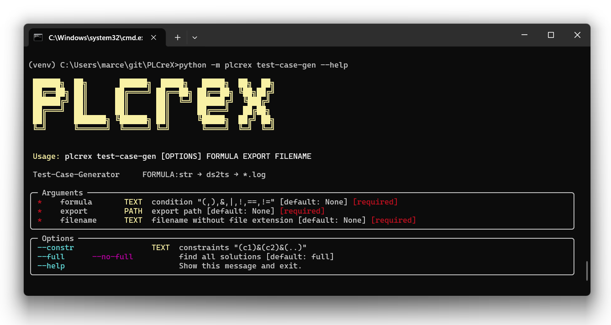

Test-Case-Generator
===================

.. test_case_gen:

The Test Case Generator feature is designed to streamline the software testing process. By utilizing the powerful SMT theorem prover, Z3, this feature automatically generates possible equivalence classes and test cases based on a given input string. There are two main features: (1) Automatic Equivalence Class Generation: The tool efficiently identifies and creates equivalence classes derived from the input string, allowing for a more thorough and systematic testing approach. (2) Test Case Creation: Utilizing the Z3 SMT theorem prover, the generator swiftly constructs test cases for each identified equivalence class, ensuring a wide range of scenarios are covered during testing.

**Usage**

.. code-block:: console

    python -m plcrex test-case-gen --help

|

Example 1: ``--full`` ``"a|b|c"``
---------------------------------

**Command**

.. code-block:: console

    python -m plcrex test-case-gen --full "a|b|c" ".\exports" "01"

**Results**

.. code-block:: console

    Original formula:       a|b|c
    SMT formula:            (or a b c)

    Test Cases:
      1: b = False, a = True, c = False
      2: b = True
      3: b = False, c = True
    ...

Example 2: ``--no-full`` ``"a|b|c"``
------------------------------------

**Command**

.. code-block:: console

    python -m plcrex test-case-gen --no-full "a|b|c" ".\exports" "02"

**Results**

.. code-block:: console

    Original formula:       a|b|c
    SMT formula:            (or a b c)

    Test Cases:
      1: b = False, a = True, c = False
    ...

Example 3: ``--full`` ``--constr="a==False"`` ``"a|b|c"``
---------------------------------------------------------

**Command**

.. code-block:: console

    python -m plcrex test-case-gen --full --constr="a==False" "a|b|c" ".\exports" "03"

**Results**

.. code-block:: console

    Original formula:       a|b|c
    Constraints:             a==False
    SMT formula:            (and (or a b c) (= a false))

    Test Cases:
      1: b = True, a = False, c = False
      2: c = True, a = False
    ...

Example 4: ``--full`` ``--constr="a==c"`` ``"(a & b) | (c == (d & e))"``
------------------------------------------------------------------------

**Command**

.. code-block:: console

    python -m plcrex test-case-gen --full --constr="a==c" "(a & b) | (c == (d & e))" ".\exports" "04"

**Results**

.. code-block:: console

    Original formula:       (a & b) | (c == (d & e))
    Constraints:             a==c
    SMT formula:            (and (or (and a b) (= c (and d e))) (= a c))

    Test Cases:
      1: b = True, a = True, c = True, d = False, e = False
      2: e = False, a = False, c = False
      3: e = True, a = False, d = False, c = False
      4: e = True, a = True, d = True, b = False, c = True
      5: e = True, a = True, d = True, b = True, c = True
      6: e = False, a = True, d = True, b = True, c = True
      7: e = True, a = True, d = False, b = True, c = True
    ...